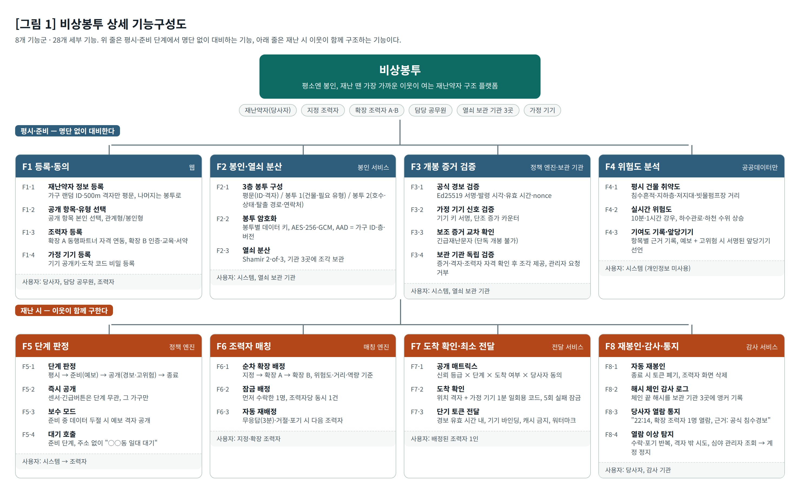
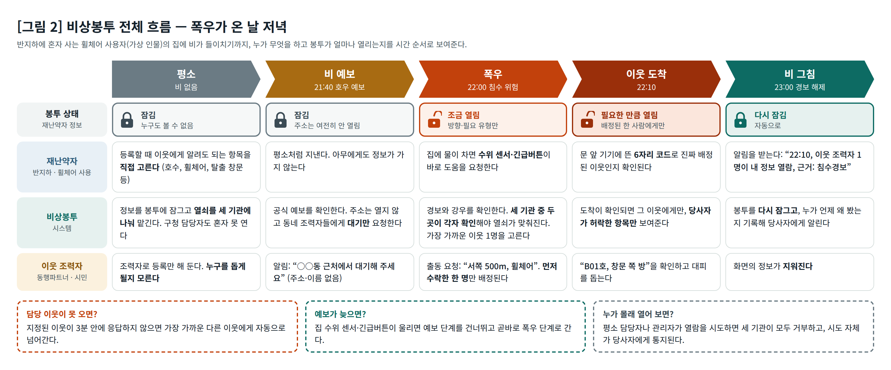
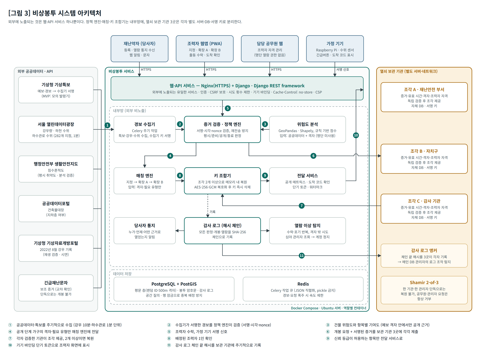

# ❷ 주요 기능 및 개발환경

비상봉투는 **8개 기능군, 28개 세부 기능**으로 구성됩니다. 평시·준비 단계의 4개 기능군(F1~F4)은 명단 없이 대비하고, 재난 시 4개 기능군(F5~F8)은 이웃이 함께 구조합니다. 모든 기능은 하나의 보안 목표를 향합니다.

> **보안 목표**: 재난약자 정보는 위험이 확인된 시간과 장소에서, 배정된 조력자 한 사람에게, 그의 신뢰 등급이 허용하는 항목만 공개되며, 그 외에는 어떤 관리자도 열 수 없다.

---

## 1. 사용자와 역할

| 사용자 | 하는 일 | 평시에 아는 것 | 사용 화면 |
|---|---|---|---|
| 재난약자 (당사자) | 등록, 공개 항목 선택, 긴급버튼, 열람 통지 수신 | 자기 정보 | 당사자 알림(웹·문자) |
| 지정 조력자 (동행파트너·대피도우미) | 담당 가구에 1순위로 출동 | 담당 가구 (기존 제도상) | 조력자 웹앱(PWA) |
| 확장 조력자 A (다른 가구의 동행파트너) | 지정 조력자 공백 시 출동 | 없음 | 조력자 웹앱(PWA) |
| 확장 조력자 B (활동 서약 시민) | 본인인증·교육·서약 후 풀 등록, 공백 시 출동 | 없음 | 조력자 웹앱(PWA) |
| 담당 공무원 | 조력자 자격 관리 | 없음 (명단 열람 권한 없음) | 담당자 웹 |
| 열쇠 보관 기관 3곳 | 개봉 증거를 각자 검증하고 열쇠 조각 제공 | 없음 (조각만 보관) | 보관 기관 서버 |
| 가정 기기 | 수위 감지·긴급버튼 신호, 재난 중 도착 코드 표시 | 없음 | Raspberry Pi |

## 2. 상세 기능구성도

## 3. 전체 흐름

폭우가 온 날 저녁을 예로 들면 흐름은 다섯 장면입니다.

1. **평소**: 재난약자의 정보는 봉투에 잠겨 있고, 열쇠는 세 기관에 나뉘어 있어 구청 담당자도 혼자 열 수 없습니다. 조력자는 누구를 돕게 될지 모른 채 등록만 해 둡니다.
2. **비 예보**: 공식 예보가 오면 동네 조력자들에게 "근처에서 대기"만 알립니다. 주소는 아직 열리지 않습니다.
3. **폭우**: 경보나 강한 비가 확인되면 세 기관 중 두 곳이 각자 확인한 뒤 열쇠가 맞춰지고, 가장 가까운 이웃 한 명이 배정됩니다. 이웃에게는 "서쪽 500m, 휠체어"처럼 방향과 필요한 도움만 보입니다.
4. **이웃 도착**: 문 앞 기기의 6자리 코드로 도착이 확인되면, 그 이웃에게만 당사자가 허락한 항목("B01호, 창문 쪽 방")이 보입니다.
5. **비 그침**: 봉투는 자동으로 다시 잠기고, 당사자는 누가 언제 어떤 근거로 자기 정보를 봤는지 알림을 받습니다.

담당 이웃이 3분 안에 응답하지 않으면 다른 이웃에게 자동으로 넘어가고, 집의 수위 센서나 긴급버튼이 울리면 예보를 기다리지 않고 곧바로 3번 장면으로 갑니다.

## 4. 기능 정의

각 기능의 입력·처리·출력과, 기능이 제대로 동작하는지 판단하는 **완료 기준**을 정의합니다. 완료 기준은 모두 자동 테스트로 검증합니다.

### F1 등록·동의

| ID | 기능 | 입력 → 처리 → 출력 | 완료 기준 |
|---|---|---|---|
| F1-1 | 재난약자 정보 등록 | 등록 정보 → 가구 랜덤 ID와 500m 격자 부여, 나머지는 봉투로 → 평문 층 레코드 | DB에 이름·주소·연락처 평문이 없다 |
| F1-2 | 공개 항목·유형 선택 | 공개할 항목(호수·상태·탈출 경로·비상연락처), 관계형/봉인형 선택 → 봉투 2에 동의 목록 함께 봉인 | 동의하지 않은 항목은 어떤 조력자에게도 공개되지 않는다 |
| F1-3 | 조력자 등록 | 확장 A: 동행파트너 자격 연동 / 확장 B: 본인인증·온라인 기본 교육·활동 서약 → 조력자 풀 등록 | 조력자는 가입만으로 어떤 가구 정보도 받지 않는다 |
| F1-4 | 가정 기기 등록 | 설치 시 기기 서명 공개키·도착 코드 비밀 생성 → 기기 명부 등록 | 등록되지 않은 기기의 신호는 거부된다 |

### F2 봉인·열쇠 분산

| ID | 기능 | 입력 → 처리 → 출력 | 완료 기준 |
|---|---|---|---|
| F2-1 | 3층 봉투 구성 | 등록 정보 → 평문(가구 ID·격자·지정 조력자 ID) / 봉투 1(건물 ID·필요 유형) / 봉투 2(호수·상태·탈출 경로·비상연락처)로 분리 | DB 탈취 시 드러나는 것은 "500m 칸 어딘가에 등록 가구가 있다"뿐이다 |
| F2-2 | 봉투 암호화 | 봉투별 256비트 데이터 키 → AES-256-GCM 암호화, 추가 인증 데이터(AAD)에 가구 ID·층·버전 → 암호문 | 다른 가구의 봉투를 바꿔 끼우면 복호화가 실패한다 |
| F2-3 | 열쇠 분산 | 데이터 키 → Shamir 2-of-3 (16바이트 두 덩어리로 나눠 각각 분산) → 재난안전 부서·자치구·감사 기관에 조각 보관 | 조각 1개로는 복원되지 않는다 |

### F3 개봉 증거 검증

| ID | 기능 | 입력 → 처리 → 출력 | 완료 기준 |
|---|---|---|---|
| F3-1 | 공식 경보 검증 | 기상특보 → 재난안전 부서 수집기가 Ed25519 서명 → 서명·발령 시각·유효 시간·일회성 값(nonce) 검증 | 내용을 바꾼 경보, 다른 키로 서명한 경보, 재전송된 경보는 거부된다 |
| F3-2 | 가정 기기 신호 검증 | 수위 센서·긴급버튼 신호 → 기기 키 서명과 단조 증가 카운터 검증 | 재전송 신호, 다른 가구의 신호로는 열리지 않는다 |
| F3-3 | 보조 증거 교차 확인 | 긴급재난문자 → 서명된 증거와 교차 확인 | 서명 없는 신호만으로는 열리지 않는다 |
| F3-4 | 보관 기관 독립 검증 | 개봉 요청 + 증거 → 각 기관이 정책 엔진을 믿지 않고 증거·유효 시간·격자 일치·조력자 자격을 직접 확인 → 조각 제공 또는 거부 | 공무원·관리자의 요청은 실제 경보 중에도 거부되고 기록된다 |

### F4 공공데이터 위험도 분석

| ID | 기능 | 입력 → 처리 → 출력 | 완료 기준 |
|---|---|---|---|
| F4-1 | 평시 건물 취약도 | 침수흔적, 지하층 여부, 저지대 여부, 빗물펌프장 거리 → 건물별 정적 점수 | 개인정보를 입력으로 쓰지 않는다 |
| F4-2 | 실시간 위험도 | 10분·1시간 강우, 하수관로·하천 수위 상승 추세 → 규칙 기반 가중 점수(0~1) | 서울시 침수 예보 기준(15분 20mm·1시간 55mm)을 강우 항목의 포화점으로 쓴다 |
| F4-3 | 기여도 기록·앞당기기 | 점수가 임계값(0.7) 이상이고 공식 예보가 있는 격자 → 항목별 기여도 기록, 정책 엔진이 앞당기기 선언에 서명 | 건물 조건만으로는 임계값을 넘지 않는다. 앞당기기 선언은 공식 예보 없이 단독으로 열 수 없다 |

### F5 단계 판정

| ID | 기능 | 입력 → 처리 → 출력 | 완료 기준 |
|---|---|---|---|
| F5-1 | 단계 판정 | 검증된 증거 + 위험도 → 평시 / 준비(예보) / 공개(경보, 예보 + 고위험) / 종료 | 맑은 날에는 모든 가구가 평시(봉인)로 유지된다 |
| F5-2 | 즉시 공개 | 가정 기기 신호 → 예보 단계와 관계없이 그 가구만 공개 단계 | 예보가 없어도 신호가 온 가구 하나만 열린다 |
| F5-3 | 보수 모드 | 준비 단계 중 데이터 수신 두절 → 예보 격자 안 등록 가구를 공개 단계로 | 현행(예보 시 출동)보다 늦게 열리는 일이 없다 |
| F5-4 | 대기 호출 | 준비 단계 → 지정 조력자에 "담당 가구 대기", 그 외 조력자에 "○○동 일대 N곳 대기" | 대기 호출에 주소·가구 정보가 없다 |

### F6 조력자 매칭

| ID | 기능 | 입력 → 처리 → 출력 | 완료 기준 |
|---|---|---|---|
| F6-1 | 순차 확장 배정 | 공개 단계 가구의 격자·필요 유형·위험도 → 지정 → 확장 A → 확장 B 순서로 거리·역량 기준 후보 호출 | 매칭 엔진은 격자와 필요 유형 외의 개인정보를 받지 않는다 |
| F6-2 | 잠금 배정 | 수락 요청 → DB 행 잠금으로 먼저 수락한 1명에게 배정, 다른 화면에서 요청 삭제 | 동시에 여러 명이 수락해도 배정은 정확히 1건이다. 조력자는 동시에 1건만 맡는다 |
| F6-3 | 자동 재배정 | 무응답(3분), 거절, 포기 → 다음 조력자에게 자동 호출 | 지정 조력자가 오지 못해도 공백이 생기지 않는다 |

### F7 도착 확인·최소 전달

| ID | 기능 | 입력 → 처리 → 출력 | 완료 기준 |
|---|---|---|---|
| F7-1 | 공개 매트릭스 | 신뢰 등급 × 단계 × 도착 여부 × 당사자 동의 → 볼 수 있는 항목 목록 (아래 표) | 확장 B는 도착 전 방향·필요 유형만, 도착 후에도 호수·탈출 경로만 본다 |
| F7-2 | 도착 확인 | 조력자 위치 격자 + 가정 기기가 재난 중에만 표시하는 1분 일회용 코드(HMAC-SHA256) → 도착 인정 | 코드가 틀리거나 위치가 다르면 거부, 5회 실패 시 잠금 |
| F7-3 | 단기 토큰 전달 | 배정 확정 + 봉투 2 개봉 → 경보 유효 시간 안에서만 쓰는 토큰(기기 바인딩, 원문 미저장) → 캐시 금지·워터마크 화면 | 만료 토큰, 다른 기기에서 쓴 토큰, 위조 토큰은 거부된다 |

### F8 재봉인·감사·통지

| ID | 기능 | 입력 → 처리 → 출력 | 완료 기준 |
|---|---|---|---|
| F8-1 | 자동 재봉인 | 경보 해제·유효 시간 만료 → 토큰 폐기, 조력자 화면 정보 삭제 | 종료 후 조력자가 화면을 새로고침하면 정보가 없다 |
| F8-2 | 해시 체인 감사 로그 | 모든 판정·개봉·열람 → SHA-256 해시 체인 기록, 체인 끝 해시를 보관 기관 3곳에 주기 기록 | 기록 수정, 전체 재작성, 잘라내기가 모두 탐지된다 |
| F8-3 | 당사자 열람 통지 | 열람 기록 → "22시 14분, 확장 조력자 1명 열람, 근거: 공식 침수경보" | 거부된 열람 시도도 당사자에게 통지된다 |
| F8-4 | 열람 이상 탐지 | 감사 로그 → 수락·포기 반복, 거부된 개봉 반복, 심야 관리자 조회 집중 탐지 → 조력자 계정 정지 | 정지된 계정에는 보관 기관이 조각을 내주지 않는다 |

### 공개 매트릭스 (F7-1)

| 조력자 | 준비 단계 | 공개 단계 (도착 전) | 공개 단계 (도착 확인 후) |
|---|---|---|---|
| 지정 조력자 | 담당 가구 대기 요청 | 동의 항목 전체 즉시 | 동의 항목 전체 |
| 확장 A | 격자 단위 대기 요청 (주소 없음) | 방향·필요 유형 | 동의 항목 전체 |
| 확장 B | 격자 단위 대기 요청 (주소 없음) | 방향·필요 유형 | 호수·탈출 경로만 (가능하면 2인 1조) |

## 5. 시스템 아키텍처

| 구성 요소 | 역할 | 사용 기술 | 배치 |
|---|---|---|---|
| 웹·API 서비스 | 담당자 웹, 조력자 웹앱, 당사자 알림, 기기 신호 수신 | Nginx(HTTPS), Django, Django REST framework | 외부 노출 (유일) |
| 경보 수집기 | 기상특보·강우·수위 주기 수집, 특보에 수집기 키로 서명 | Celery 주기 작업, Redis | 내부망 |
| 증거 검증·정책 엔진 | 서명·시각·nonce 검증, 재전송 방지, 단계 판정 | Python, cryptography(Ed25519) | 내부망 |
| 위험도 분석 | 건물 취약도·실시간 위험도, 항목별 기여도 | GeoPandas, Shapely | 내부망 |
| 매칭 엔진 | 순차 확장 배정, 잠금 배정, 자동 재배정 | Python, PostgreSQL 행 잠금 | 내부망 |
| 키 조합기 | 조각 2개 이상으로 키 복원, 봉투 복호화 후 즉시 삭제 | pycryptodome (Shamir, AES-GCM) | 내부망 |
| 전달 서비스 | 공개 매트릭스, 도착 코드 확인, 단기 토큰, 워터마크 | Python, secrets, hmac | 내부망 |
| 감사·통지·이상 탐지 | 해시 체인 로그, 당사자 통지, 규칙 기반 이상 탐지 | hashlib(SHA-256) | 내부망 |
| 열쇠 보관 기관 × 3 | 증거 독립 검증 후 조각 제공, 로그 앵커 기록 | 같은 코드를 설정만 바꿔 3회 배포, 기관별 별도 DB·서명 키 | 별도 네트워크 |
| 데이터 저장 | 평문 층·봉투 암호문·감사 로그, 공간 질의 | PostgreSQL + PostGIS | 내부망 |

## 6. 개발환경

### 6-1. 개발 플랫폼·도구

| 구분 | 사용 기술 | 선택 이유 |
|---|---|---|
| 서버 OS | Ubuntu Server 22.04 LTS | 장기 지원, Docker·PostGIS 패키지 안정성 |
| 개발 PC | Windows / macOS + VS Code | 팀원별 환경 차이는 Docker로 흡수 |
| 컨테이너·배포 | Docker, Docker Compose (역할별 컨테이너, 내부 네트워크 분리) | 보관 기관 3곳·정책 엔진·키 조합기를 외부와 격리하고 같은 코드를 설정만 바꿔 3회 배포 |
| 형상 관리 | Git, GitHub | 코드 리뷰, 변경 이력 추적 |
| CI | GitHub Actions | 매 커밋마다 테스트·보안 자가진단 자동 실행 |

### 6-2. 언어·프레임워크·라이브러리

| 구분 | 사용 기술 | 선택 이유 | 관련 기능 |
|---|---|---|---|
| 언어 | Python 3.12 | 대회 지정 언어, 공간 분석·암호 라이브러리 생태계 | 전체 |
| 웹·API | Django, Django REST framework | CSRF 방어, ORM 파라미터 바인딩(SQL 삽입 방지), 템플릿 자동 이스케이프(XSS 방지)를 기본 제공 | F1, F5-4, F7, F8-3 |
| 암호 | pycryptodome (AES-GCM, Shamir) | 검증된 라이브러리만 사용, 암호 직접 구현 금지 | F2, F7-3 |
| 서명 | cryptography (Ed25519) | 짧은 키·빠른 검증, 서명 위조·변조 탐지 | F1-4, F3, F4-3 |
| 난수·해시 | 표준 라이브러리 secrets, hmac, hashlib | 예측 불가능한 키·토큰·nonce, 상수 시간 비교, SHA-256 해시 체인 | F2, F7-2, F8-2 |
| 공간 분석 | GeoPandas, Shapely | 건물·침수흔적·500m 격자 공간 결합 | F2-1, F4 |
| 저장 | PostgreSQL + PostGIS | 공간 질의, 행 잠금(SELECT … FOR UPDATE)으로 중복 배정 방지 | F2, F6-2, F8-2 |
| 비동기 처리 | Celery (JSON 직렬화) + Redis | 경보 수집·분석 주기 작업, 폭주 시 작업 큐. pickle 직렬화 금지 | F3-1, F4-2 |
| 조력자 앱 | 웹앱(PWA) | 설치 부담 없음, 캐시 금지 헤더로 정보 잔존 방지 | F6, F7 |
| 테스트 | pytest | 기능별 완료 기준과 보안 시나리오를 자동 테스트로 검증 | 전체 |

### 6-3. 사용 공공데이터·외부 API

| 데이터 | 제공처 | 제공 방식·주기 | 관련 기능 |
|---|---|---|---|
| 기상특보 (호우 예보·경보) | 기상청 | OpenAPI. MVP에서는 모의 발령기로 대체하고 수집기 서명 구조를 검증 | F3-1, F5-1 |
| 서울시 강우량 정보 | 서울 열린데이터광장 | OpenAPI | F4-2 |
| 서울시 하천 수위 현황 | 서울 열린데이터광장 | OpenAPI | F4-2 |
| 서울시 하수관로 수위 | 서울 열린데이터광장 | OpenAPI, 282개 지점 1분 단위 | F4-2 |
| 침수흔적도 | 행정안전부 생활안전지도 | 공간 데이터 | F4-1, 분석 검증 |
| 건축물대장 (지하층 여부) | 공공데이터포털 | OpenAPI | F4-1 |
| 2022년 8월 강우 기록 | 기상청 기상자료개방포털 | 파일 내려받기 | 재생 검증, 결선 시연 |
| 긴급재난문자 | 행정안전부 | 제공 방식 확인 중 | F3-3 |

### 6-4. 하드웨어 (시연용 가정 기기)

| 구성 | 용도 | 관련 기능 |
|---|---|---|
| Raspberry Pi | 가정 침수경보기·긴급버튼 모사, 기기 서명 키 보관 | F1-4, F3-2, F5-2 |
| 수위 센서 | 물컵에 담가 침수 신호 발생 (결선 시연 5장면) | F3-2, F5-2 |
| 푸시 버튼 | 긴급버튼 | F3-2, F5-2 |
| 소형 디스플레이 | 재난 중에만 1분 일회용 도착 코드 표시 | F7-2 |

### 6-5. 보안 자가진단 도구

| 도구 | 점검 내용 | 실행 시점 |
|---|---|---|
| Bandit | Python 코드 보안약점 (하드코드 비밀, 취약 암호, 위험 함수) | 매 커밋 CI |
| Semgrep | 행정안전부 보안약점 항목별 규칙 점검 | 매 커밋 CI |
| pip-audit | 의존 라이브러리 알려진 취약점 | 매 커밋 CI |
| gitleaks | 저장소에 커밋된 키·API 키 | 매 커밋 CI |
| Django check --deploy | 운영 설정 (DEBUG, 보안 헤더, 쿠키) | 배포 전 |

### 6-6. 개발환경이 기능에 적절한 이유

- **보관 기관 분리 (F3-4)**: Docker Compose로 보관 기관 3곳을 별도 컨테이너·네트워크·DB로 띄우고, 같은 코드를 설정만 바꿔 배포합니다. "한 기관을 탈취해도 복원 불가"를 시연 환경에서 그대로 재현할 수 있습니다.
- **암호 (F2, F3, F7)**: AES-256-GCM, Ed25519, HMAC-SHA256은 모두 행정안전부 개발보안 가이드가 권고하는 강한 알고리즘이며, 검증된 라이브러리(pycryptodome, cryptography)로만 구현합니다.
- **동시 수락 (F6-2)**: PostgreSQL 행 잠금으로 "검사 시점과 사용 시점" 경쟁조건을 원자적으로 막습니다.
- **공간 분석 (F4)**: PostGIS와 GeoPandas로 건물·침수흔적·격자를 결합하되, 분석 엔진은 명단을 입력으로 받지 않습니다.
- **웹 보안 (F1, F7)**: Django가 CSRF·SQL 삽입·XSS 방어를 기본 제공해, 49개 보안약점 추적표의 웹 항목을 프레임워크 수준에서 대응합니다.
